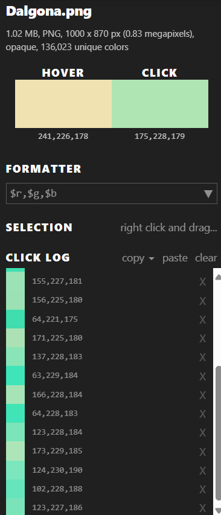

# Description :
- Will you survive the Squid Games?
- Challenge link : https://blueteamlabs.online/home/challenge/squid-game-12b0862d18
# Solution :

## Q1 : What is the phone number on the invitation card in Squid Game? (Research this online!) ?

- Answer : ```86504006```
- You can search Google for this answer !
## Q2 : Can you extract something from the invitation card file? What is the name of the file?

- Answer : ```Dalgona.png```
- I gave up once on this challenge, until I looked at the tools section and remembered Q1. After that, i use ```steghide``` and use pass is answer of Q1. And it worked !

## Q3 : What hint text can be discovered in the final file?

- Answer : ```Red Pixel```
- Using ```stegsolve```, you can see it. 
## Q4 : What is the final flag?

- Answer : ```SBT{S4v3_My4nm4r_Guy5}```
- This is probably the hardest part for me, because I used stegsolve's ``extract data``` but got no results, even though I could see the part I was looking for, a tiny part in the middle of the image. I noticed it because I did some similar challenges. 
Until I was about to give up and look for WU but they were too few, even non-existent. But I found this [article](https://www.linkedin.com/pulse/squid-game-write-up-t%E1%BA%A5n-nguy%E1%BB%85n-%C4%91%E1%BB%A9c-gilxc) . And found the tool I was looking for - pixspy. When using it and taking the color points we initially suspected, we will get the following :

  
- Take each initial value and put it into the ASCII decoding tool, we will get the flag.

# Conclusion

- Thanks for reading my writeup. Have a good day!
